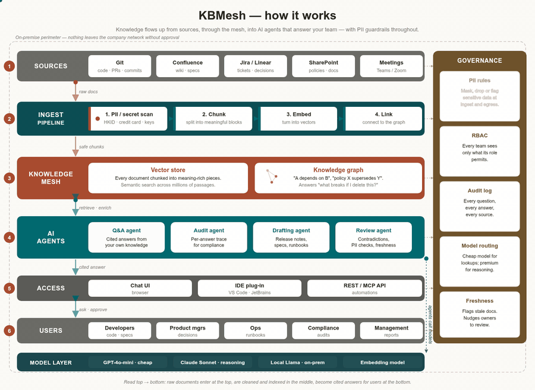
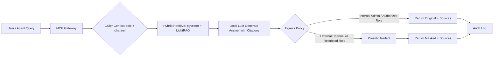
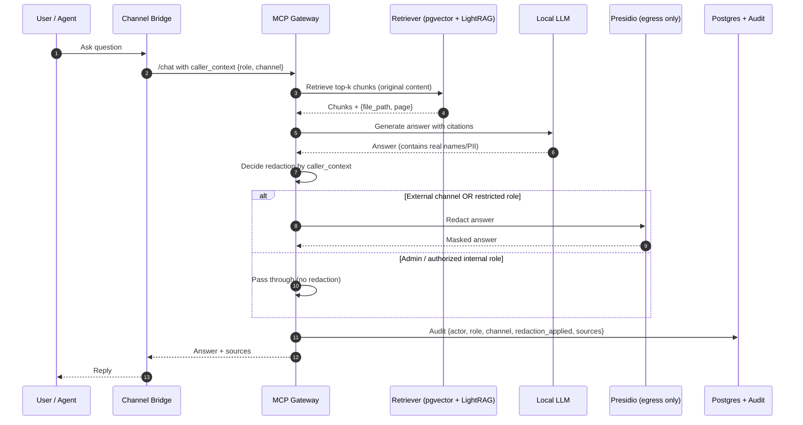
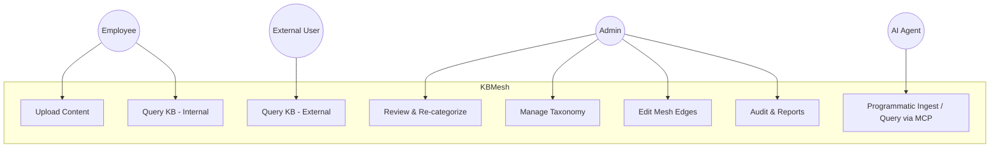
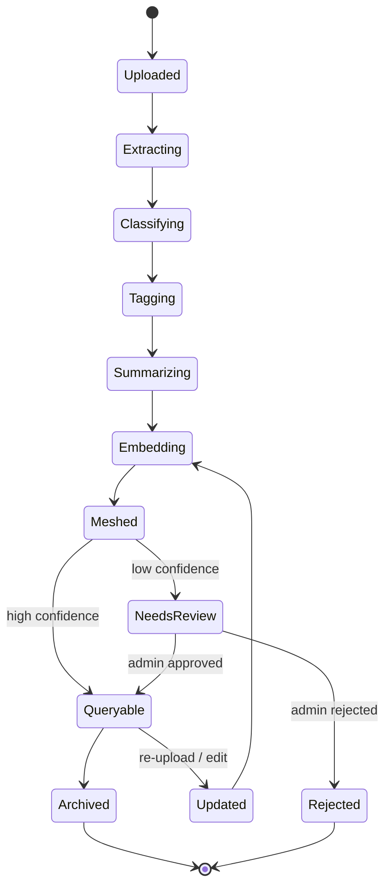
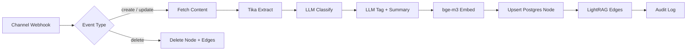

# KBMesh — Secure AI Knowledge Base Mesh

> *"One mesh. Every agent. Zero leakage."*

**Version:** 0.3
**Date:** 2026-05-05
**Author:** KBMesh Project
**License:** Apache-2.0 (suggested)

***

## Table of Contents

1. [Executive Summary](#1-executive-summary)
2. [Architecture Overview](#2-architecture-overview)
3. [Core Concepts](#3-core-concepts)
4. [Flow 1 — AI-Native Ingestion](#4-flow-1--ai-native-ingestion)
5. [Flow 2 — Query with Egress Redaction](#5-flow-2--query-with-egress-redaction)
6. [Sequence Diagram](#6-sequence-diagram)
7. [Use Case Diagram](#7-use-case-diagram)
8. [State Diagram — Document Lifecycle](#8-state-diagram--document-lifecycle)
9. [n8n Ingestion Workflow](#9-n8n-ingestion-workflow)
10. [Technology Stack](#10-technology-stack)
11. [Security \& Privacy Model](#11-security--privacy-model)
12. [MCP Tool Surface](#12-mcp-tool-surface)
13. [Data Model](#13-data-model)
14. [Phased Build Plan](#14-phased-build-plan)
15. [Docker Compose — Phase 1 \& 2](#15-docker-compose--phase-1--2)
16. [Admin Portal — KBMesh Studio](#16-admin-portal--kbmesh-studio)
17. [PII Handling Model — Egress-Only Redaction](#17-pii-handling-model--egress-only-redaction)
18. [Project Brand — KBMesh](#18-project-brand--kbmesh)
19. [Repository Layout](#19-repository-layout)
20. [Open Items / Next Deliverables](#20-open-items--next-deliverables)

***

## 1. Executive Summary

**KBMesh** is an on-premise, AI-native knowledge base that ingests content from any channel (WebUI, WhatsApp, Telegram, email, API), uses a local LLM to auto-categorize, label, summarize, and **mesh** every node into a living knowledge graph, and exposes a unified **MCP** interface so any AI agent (Perplexity Comet, OpenClaw, MiniMax, Claude, Cursor) can query it without custom integration.

All raw content — including PII — stays inside the company network. **Redaction is enforced only at egress**, when answers leave the trust boundary through external channels. Authorized internal users and the admin portal always see the original content.

### Key Capabilities

- AI-native ingestion: drop anything in, AI files it, mesh grows smarter.
- Multi-channel capture: WebUI, WhatsApp, Telegram, email, REST/MCP.
- Local LLMs (Ollama + Qwen / Llama) for classification, tagging, summarization, embeddings, and answer generation.
- GraphRAG mesh via **LightRAG** + **pgvector** for hybrid semantic + graph retrieval.
- **Egress-only PII & sensitive-data redaction** via Microsoft Presidio. Covers (a) global PII — person names, emails, phone numbers, postal addresses, dates of birth, IPs, URLs; (b) government IDs — passport, US SSN, UK NINO, EU national IDs, etc.; (c) **payment / PCI data** — credit/debit card PAN (Visa/Mastercard/Amex/Discover/JCB/UnionPay, Luhn-validated), CVV/CVC, expiry, IBAN, SWIFT/BIC, bank account/routing numbers, crypto wallet addresses; (d) **credentials & secrets** — API keys, JWTs, AWS/GCP/Azure access keys, private keys, OAuth tokens; (e) **medical/health** — MRN, ICD/CPT codes, health record numbers; (f) **regional packs** including HK (HKID, HK phone +852, HK address), with pluggable packs for SG NRIC, CN ID, TW ID, JP MyNumber, etc.
- Admin portal for review, re-categorization, mesh editing, taxonomy management.
- Universal MCP gateway for all AI agents.
- Zero internet egress on the RAG subnet; Tailscale for private access.

***

## 2. Architecture Overview

```
┌─────────────────────────────────────────────────────────────────┐
│  COMPANY LAN — KBMesh Trust Boundary (no public egress)         │
│                                                                 │
│  Channels                                                       │
│   ├─ WebUI (PWA)                                                │
│   ├─ WhatsApp Bridge                                            │
│   ├─ Telegram Bridge                                            │
│   ├─ Email (IMAP via n8n)                                       │
│   └─ REST / MCP API                                             │
│                  │                                              │
│                  ▼                                              │
│           MCP Gateway (Fastify) ◄──── Egress filter (Presidio)  │
│                  │                                              │
│        ┌─────────┼─────────┐                                    │
│        ▼         ▼         ▼                                    │
│   Ingestion   Query      Admin                                  │
│   Pipeline    Engine     Portal API                             │
│        │         │         │                                    │
│        ▼         ▼         ▼                                    │
│  ┌─────────────────────────────────────────────┐                │
│  │  Local LLM (Ollama)                         │                │
│  │   • bge-m3 (embeddings)                     │                │
│  │   • qwen2.5:7b (classify / tag / summarize) │                │
│  │   • qwen2.5:32b (answer generation)         │                │
│  └─────────────────────────────────────────────┘                │
│        │                                                        │
│        ▼                                                        │
│  ┌─────────────────────────────────────────────┐                │
│  │  Storage Layer (encrypted at rest)          │                │
│  │   • PostgreSQL (nodes, edges, audit)        │                │
│  │   • pgvector (embeddings)                   │                │
│  │   • LightRAG (graph mesh)                   │                │
│  │   • file_blobs (encrypted file store)       │                │
│  └─────────────────────────────────────────────┘                │
│                                                                 │
│  Orchestration: n8n   |   Networking: Tailscale                 │
└─────────────────────────────────────────────────────────────────┘
```

### Visual Architecture



Knowledge flows up the stack: **Sources → Ingest → Knowledge Mesh → AI Agents → Access → Users**, with the governance rail (PII rules, RBAC, audit, model routing, freshness) on the right and the model/token layer at the bottom. The animation shows data packets streaming through each band, the mesh pulsing, agents breathing, and the PII scan stripe flashing.

**Other formats:**
- [kbmesh_architecture.svg](docs/assets/kbmesh_architecture.svg) — vector source, animates natively in any browser (29 KB, self-contained)
- [kbmesh_architecture.mp4](docs/assets/kbmesh_architecture.mp4) — H.264 video for slide decks (287 KB)
- [kbmesh_architecture.png](docs/assets/kbmesh_architecture.png) — static still for documents that can't render motion

***

## 3. Core Concepts

| Concept | Meaning in KBMesh |
| :-- | :-- |
| **Node** | A unit of knowledge (document, message, image transcript, voice note). |
| **Edge** | AI-detected or admin-curated relation between nodes (mentions, derived_from, part_of). |
| **Mesh** | The full graph of nodes + edges; grows organically with each ingest. |
| **Channel** | Entry point for content (WebUI, WhatsApp, Telegram, email, API). |
| **Trust Boundary** | The company LAN; redaction occurs only when crossing it. |
| **Caller Context** | `{role, channel}` tuple used by gateway to decide redaction policy. |


***

## 4. Flow 1 — AI-Native Ingestion

```mermaid
flowchart LR
  A[User uploads via WebUI / WA / TG / Email / API] --> B[MCP Gateway /ingest]
  B --> C[Tika / Unstructured Extract Text]
  C --> D[Whisper Audio / Vision Caption if needed]
  D --> E[Local LLM Classify Category]
  E --> F[Local LLM Generate Tags + Summary]
  F --> G[Entity Extraction]
  G --> H[Embed with bge-m3]
  H --> I[Upsert Node in Postgres]
  I --> J[Insert Mesh Edges via LightRAG]
  J --> K[Encrypt File Blob at Rest]
  K --> L[Mark for Admin Review if Confidence Low]
```



**Key principle:** Original content is stored as-is (encrypted at rest). No redaction at ingest.

***

## 5. Flow 2 — Query with Egress Redaction




***

## 6. Sequence Diagram




***

## 7. Use Case Diagram




***

## 8. State Diagram — Document Lifecycle




***

## 9. n8n Ingestion Workflow




***

## 10. Technology Stack

| Layer | Tool | Purpose |
| :-- | :-- | :-- |
| Channels | WebUI (React PWA), whatsapp-web.js, node-telegram-bot-api, n8n IMAP | Multi-channel capture |
| Gateway | Fastify + MCP SDK | Single entry point + egress policy |
| Orchestration | n8n | Pipeline glue, channel handlers |
| Extraction | Apache Tika, Unstructured, Whisper, vision model | Text/audio/image → text |
| Local LLM | Ollama + Qwen2.5 / Llama3.1 | Classify, tag, summarize, answer |
| Embeddings | bge-m3 | Multilingual EN/中文 |
| Vector DB | PostgreSQL + pgvector | Hybrid retrieval |
| Graph RAG | LightRAG | Mesh / entity reasoning |
| PII / Sensitive-Data Egress Filter | Microsoft Presidio + global recognizers + payment-card / secrets / regional packs | Redaction at boundary only; covers global PII, PCI (PAN/CVV/IBAN/SWIFT), credentials, health, and regional IDs |
| File Storage | Encrypted blob store on VM-host | At-rest protection |
| Networking | Tailscale | Private device access |
| Versioning | Gitea (optional) | Audit trail |


***

## 11. Security \& Privacy Model

- **Trust boundary = MCP Gateway egress.** Inside the boundary, content lives in plaintext (encrypted at rest); outside, it must pass redaction policy.
- **Encryption at rest**: LUKS volume on VM-host; Postgres TDE optional; file blobs encrypted with envelope keys.
- **Network segmentation**: RAG subnet has no outbound internet (except Ollama model pulls via proxy).
- **TLS everywhere**: mTLS between containers; Tailscale for client access.
- **RBAC**: roles (admin, hr, finance, it, general, external_agent) gate redaction and node visibility.
- **Audit log**: every query records caller, role, channel, redaction_applied, sources.
- **Recognizer coverage** (Presidio analyzer + custom packs):
  - **Global PII**: PERSON, EMAIL_ADDRESS, PHONE_NUMBER, LOCATION, DATE_TIME (DOB), IP_ADDRESS, URL, NRP.
  - **Government IDs**: US_SSN, US_DRIVER_LICENSE, US_PASSPORT, US_ITIN, UK_NHS, UK_NINO, AU_TFN, AU_MEDICARE, IN_AADHAAR, IN_PAN, ES_NIF, IT_FISCAL_CODE, SG_NRIC_FIN, plus EU national IDs.
  - **Payment / PCI**: CREDIT_CARD (Luhn-checked across Visa, Mastercard, Amex, Discover, JCB, Diners, UnionPay), CVV/CVC, card expiry, IBAN, SWIFT/BIC, US bank account + ABA routing, SEPA references, common crypto wallet addresses (BTC, ETH).
  - **Credentials & secrets**: API_KEY (generic high-entropy), JWT, AWS_ACCESS_KEY / AWS_SECRET, GCP_SERVICE_ACCOUNT, AZURE_KEY, PRIVATE_KEY (PEM), OAuth bearer tokens, Slack/GitHub/Stripe tokens.
  - **Health**: MEDICAL_LICENSE, MRN, ICD-10/CPT codes, health record numbers.
  - **Regional packs**: HK (HKID with checksum, HK phone +852/8-digit, HK address); CN ID; TW ID; JP MyNumber; SG NRIC/FIN; pluggable for other locales.
- **Air-gap option**: stack runs without internet; models updated via sneakernet.

***

## 12. MCP Tool Surface

| Tool | Purpose |
| :-- | :-- |
| `kb.ingest` | Submit content from any channel; returns node_id + AI labels |
| `kb.ask` | Q\&A with citations; redaction by caller_context |
| `kb.search` | Hybrid semantic + keyword search |
| `kb.graph` | Walk mesh edges from a node |
| `kb.get_node` | Fetch node (full content for admins, redacted for external) |
| `kb.suggest_category` | Preview AI classification without saving |
| `kb.link` / `kb.unlink` | Edit mesh edges (admin / authorized agents) |
| `kb.relabel` | Change category/tags; triggers re-embed |
| `kb.review_queue` | Admin: list unreviewed nodes |
| `kb.audit` | Query audit log |

All tools accept `caller_context: { role, channel }` so the gateway applies the correct egress policy.

***

## 13. Data Model

```sql
CREATE EXTENSION IF NOT EXISTS vector;
CREATE EXTENSION IF NOT EXISTS pgcrypto;

CREATE TABLE nodes (
  id uuid PRIMARY KEY DEFAULT gen_random_uuid(),
  title text,
  category text,
  tags text[],
  summary text,
  content text,                  -- ORIGINAL content, encrypted at rest
  source_channel text,
  uploader text,
  file_blob_id uuid,
  original_filename text,
  mime_type text,
  ai_confidence float,
  reviewed boolean DEFAULT false,
  reviewed_by text,
  reviewed_at timestamptz,
  embedding vector(1024),
  created_at timestamptz DEFAULT now(),
  updated_at timestamptz DEFAULT now()
);

CREATE INDEX ON nodes USING ivfflat (embedding vector_cosine_ops) WITH (lists = 100);
CREATE INDEX ON nodes USING gin (to_tsvector('simple', content));
CREATE INDEX ON nodes (category);
CREATE INDEX ON nodes USING gin (tags);

CREATE TABLE edges (
  id bigserial PRIMARY KEY,
  src_node uuid REFERENCES nodes(id) ON DELETE CASCADE,
  dst_node uuid REFERENCES nodes(id) ON DELETE CASCADE,
  relation text,
  weight float,
  created_by text,
  created_at timestamptz DEFAULT now()
);

CREATE TABLE taxonomy (
  category text PRIMARY KEY,
  description text,
  parent_category text,
  color text
);

CREATE TABLE file_blobs (
  id uuid PRIMARY KEY,
  sha256 text UNIQUE,
  storage_path text,
  size_bytes bigint,
  encryption_key_id text,
  created_at timestamptz DEFAULT now()
);

CREATE TABLE audit (
  id bigserial PRIMARY KEY,
  actor text,
  role text,
  channel text,
  action text,                   -- query | ingest | relabel | link | unlink
  query text,
  sources jsonb,
  redaction_applied boolean,
  redaction_reason text,
  ts timestamptz DEFAULT now()
);
```

> **Note:** The `pii_map` table from prior versions is removed — original content is stored directly. PII protection is now enforced via egress redaction + encryption at rest + RBAC.

***

## 14. Phased Build Plan

| Phase | Scope | Deliverable |
| :-- | :-- | :-- |
| 1 | Local stack: Postgres+pgvector, Ollama, LightRAG, n8n, Presidio | Working ingestion via WebUI |

