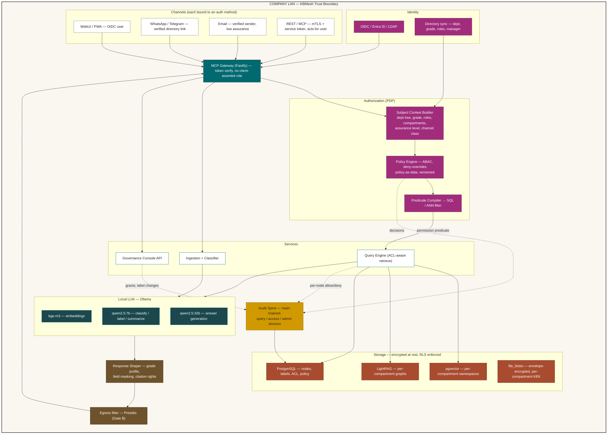
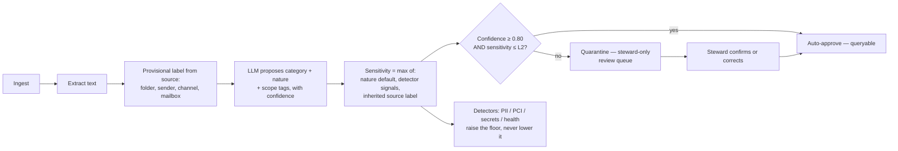
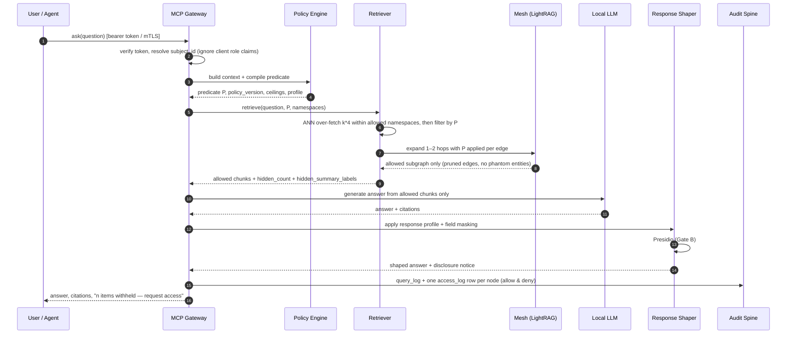

# KBMesh Design v0.4 — Multi-Department Access Control, Classification & Audit

> *"One mesh. Every agent. Every answer earned."*

**Version:** 0.4 (extends v0.3)
**Date:** 2026-09-22
**Status:** Design — supersedes the security model of §11 in v0.3
**Scope of change:** organizational model, multi-axis classification, authorization engine, role-differentiated answering, audit & evidence.

---

## Table of Contents

1. [Review of v0.3 — What Breaks at Multi-Department Scale](#1-review-of-v03--what-breaks-at-multi-department-scale)
2. [Design Principles for v0.4](#2-design-principles-for-v04)
3. [Revised Architecture](#3-revised-architecture)
4. [Organizational Model — Departments, Grades, Roles](#4-organizational-model--departments-grades-roles)
5. [Classification Model — Five Axes](#5-classification-model--five-axes)
6. [Authorization Engine — Two-Gate Model](#6-authorization-engine--two-gate-model)
7. [Compartments and Index Isolation](#7-compartments-and-index-isolation)
8. [ACL-Aware Retrieval and Graph Traversal](#8-acl-aware-retrieval-and-graph-traversal)
9. [Role-Differentiated Answering](#9-role-differentiated-answering)
10. [Existence Disclosure and Access Requests](#10-existence-disclosure-and-access-requests)
11. [Derived-Content Label Propagation](#11-derived-content-label-propagation)
12. [Audit, Evidence and Anomaly Detection](#12-audit-evidence-and-anomaly-detection)
13. [Data Model — Full DDL](#13-data-model--full-ddl)
14. [MCP Tool Surface v0.4](#14-mcp-tool-surface-v04)
15. [Admin Portal Additions — Governance Console](#15-admin-portal-additions--governance-console)
16. [Worked Example — One Question, Five Answers](#16-worked-example--one-question-five-answers)
17. [Conformance Test Matrix](#17-conformance-test-matrix)
18. [Phased Build Plan v0.4](#18-phased-build-plan-v04)
19. [Residual Risks and Open Decisions](#19-residual-risks-and-open-decisions)

---

## 1. Review of v0.3 — What Breaks at Multi-Department Scale

v0.3 is a strong single-trust-zone design: one mesh, everything in plaintext inside the LAN, Presidio masking on the way out. That model assumes **everyone inside the boundary may see everything inside the boundary**. Once you add departments, grades and need-to-know, eight things break.

| # | Finding in v0.3 | Why it fails | v0.4 fix |
| :-- | :-- | :-- | :-- |
| R1 | **Authorization happens at egress.** The gateway retrieves original chunks, generates the answer, then decides whether to redact. | Restricted content has already entered the prompt. A prompt-injected document, a jailbroken answer, a logged prompt, or a masking miss leaks it. Redaction is a *data-minimisation* control, not an *access* control. | Authorization moves **before retrieval** (Gate A). Egress redaction stays as Gate B, defence-in-depth only. |
| R2 | **`caller_context: {role, channel}` is asserted by the client.** Every MCP tool takes it as a parameter. | Any agent or curl call can claim `role: "admin"`. This is the single most serious flaw — it makes the whole model advisory. | Subject identity is derived server-side from an OIDC/mTLS token. `caller_context` becomes untrusted *hints* only (locale, verbosity). |
| R3 | **RBAC is a flat string list** (`admin, hr, finance, it, general, external_agent`) and `nodes` has no owner/sensitivity column. | Cannot express "Finance Manager in HK sees L2 finance docs but not payroll", nor cross-department sharing, nor project need-to-know. Roles explode combinatorially. | Multi-axis labels + ABAC policy over (subject × resource × action × context). |
| R4 | **One shared vector index and one LightRAG graph.** | Similarity search sees all vectors; graph walk (`kb.graph`) traverses edges into nodes the caller cannot read. Entity names and relation labels leak restricted facts even when node bodies are hidden. | Permission predicate pushed into the ANN filter + namespaced indexes per compartment + ACL-aware traversal that prunes at the edge, not after. |
| R5 | **AI-derived artifacts are unlabelled.** Summaries, tags, entities and edges are generated from original content and stored as ordinary columns. | A summary of a restricted document is itself restricted, but v0.3 would serve it to anyone who can see the node's metadata. | High-water-mark label propagation for all derived artifacts. |
| R6 | **Audit is a single mutable table** with `actor` and `role` as free text, one row per query. | No per-document decision record, no tamper evidence, no entitlement-change history, no deny records. Cannot answer "who could have seen this document last March". | Hash-chained append-only audit, three log streams (query, access decision, administration), plus point-in-time entitlement reconstruction. |
| R7 | **Taxonomy is a single `category` string** with one optional parent. | Real content is simultaneously *owned by* a department, *about* a topic, *of a nature* (contract vs SOP vs personal record) and *at a sensitivity*. Collapsing these into one string forces either 400 categories or wrong permissions. | Four independent axes + free tags. |
| R8 | **No aggregation, probing or rate controls.** | A junior can extract restricted facts by asking 50 narrow questions, or by asking for aggregates that reveal individuals. | Per-subject query budgets, repeated-denial alerting, minimum-cohort rule for aggregate answers. |

Two smaller repo-hygiene items: the published `README.md` and `docs/KBMesh-Design-v0.3.md` both **truncate mid-§14** — sections 15–20 listed in the table of contents (Docker Compose, KBMesh Studio, PII model, brand, repo layout, next deliverables) are missing from the committed files. Worth restoring before this version lands on top.

---

## 2. Design Principles for v0.4

1. **Deny by default.** No label → not retrievable by anyone except the owning steward and the review queue.
2. **Authorize before retrieval.** If a subject may not read a chunk, that chunk never enters the context window. The LLM is never a security boundary.
3. **Identity is proven, never declared.** All authorization inputs come from a verified token or the directory, not from tool arguments.
4. **Labels travel with derivatives.** Summaries, embeddings, entities and edges inherit the strictest label of their sources.
5. **One policy, many enforcement points.** A single policy set is compiled to (a) a SQL predicate for retrieval, (b) a Postgres RLS backstop, (c) an API guard, (d) an admin simulator. No second implementation to drift.
6. **Every decision is evidence.** Allow *and* deny are recorded, per node, with the policy version that decided it.
7. **Differentiation by visibility first, wording second.** Two grades get different answers mainly because they saw different documents — not because the model was told to be vaguer.
8. **Explainable access.** Any user can ask why they saw something; any steward can ask who can see something.
9. **Fail closed.** Policy service unavailable, label missing, or classification confidence below threshold ⇒ no access.

---

## 3. Revised Architecture



**What moved.** The PDP sits between the gateway and the query engine. Retrieval never runs unfiltered. Presidio is demoted from "the security model" to the last of four layers: entitlement filter → field masking → response profile → PII/PCI redaction.

---

## 4. Organizational Model — Departments, Grades, Roles

Three independent dimensions, all sourced from the corporate directory so KBMesh is never the master of HR truth.

### 4.1 Department tree

Departments form a closure-table hierarchy so a Division Head inherits the subtree without enumerating children.

```
ORG
├── Corporate
│   ├── Executive Office        (EXEC)
│   ├── Finance                 (FIN)
│   │   ├── Financial Control   (FIN-CTL)
│   │   └── Payroll             (FIN-PAY)      ← compartmented
│   ├── Human Resources         (HR)
│   │   ├── Talent Acquisition  (HR-TA)
│   │   └── Employee Relations  (HR-ER)        ← compartmented
│   └── Legal & Compliance      (LEG)          ← privilege compartment
├── Delivery
│   ├── Innovation & Solution Centre (ISC)
│   ├── Infrastructure Services (INF)
│   ├── Application Services    (APP)
│   ├── Cyber Security          (SEC)
│   └── Managed Services        (MS)
├── Commercial
│   ├── Sales                   (SLS)
│   ├── Presales / Bid          (BID)
│   └── Marketing               (MKT)
└── Shared
    ├── IT Internal             (ITI)
    ├── Quality & PMO           (PMO)
    └── Procurement             (PRC)
```

Membership types: `primary`, `secondary` (matrixed/seconded), `steward` (data owner for the department's content), `delegate` (time-boxed acting cover).

### 4.2 Grade bands

Grade is an ordered band, independent of role. It sets the **default clearance ceiling**, never the access itself.

| Band | Label | Default ceiling in own department | Cross-department default |
| :-- | :-- | :-- | :-- |
| G1 | Associate / Engineer | L1 Internal | L0 |
| G2 | Senior / Consultant | L2 Confidential | L0 |
| G3 | Lead / Manager | L2 Confidential | L1 |
| G4 | Senior Manager / Head | L3 Restricted | L1 |
| G5 | Division Head / Director | L3 Restricted (+ subtree) | L2 |
| G6 | Executive / C-level | L4 with compartment grant | L2 |

Grade alone never opens a compartment. A G6 CEO does not read Employee Relations case files without an explicit, expiring, logged grant.

### 4.3 Functional roles

Roles carry **action** rights, not read scope: `kb.reader`, `kb.contributor`, `kb.steward` (classify, approve, share within own department), `kb.taxonomy_admin`, `kb.policy_admin`, `kb.auditor` (read all audit, **no** content), `kb.security_officer` (break-glass approver), `kb.agent_operator` (may mint agent tokens acting-for self).

Separation of duties is mandatory: `kb.policy_admin` cannot hold `kb.auditor`; no role grants both "change policy" and "delete audit" (nothing grants the latter at all).

### 4.4 Non-human subjects

An AI agent is a first-class subject with its own identity, and always **acts-for** a human principal. Its effective permission is `min(agent_grant, principal_permission)` — never more than the human behind it. Agent tokens carry `assurance: agent`, a TTL under 15 minutes, and a declared purpose used in audit.

### 4.5 Channel assurance

| Channel | Assurance | Max sensitivity served |
| :-- | :-- | :-- |
| WebUI with OIDC + MFA | high | up to subject ceiling |
| Desktop/MCP with mTLS | high | up to subject ceiling |
| WhatsApp / Telegram, directory-verified | medium | L1 (L2 opt-in per department) |
| Email reply | low | L1 |
| External / partner portal | external | L0 only |

Effective sensitivity = `min(grade ceiling, role scope, channel cap, device posture cap)`. This is how "the same person asking from WhatsApp gets less" is expressed declaratively.

---

## 5. Classification Model — Five Axes

Replace the single `category` string with five orthogonal axes. Axis 1–3 come from the AI classifier with human confirmation; axis 4 is policy-driven; axis 5 is free-form.

### Axis 1 — Ownership (`owner_dept`, `shared_with`)

Exactly one owning department (accountable steward) plus explicit shares: `{dept | team | project | person, grant_type, expires_at}`. Ownership answers "who decides", shares answer "who else may read".

### Axis 2 — Category (topic taxonomy, hierarchical)

Multi-label — a document may sit in several. Example top level: `HR`, `Finance`, `Legal & Contracts`, `Sales & Bids`, `Delivery & Projects`, `Technical & Architecture`, `Security & Risk`, `Operations & Support`, `Product & IP`, `Corporate Strategy`, `Procurement & Vendors`, `Training & Enablement`.

### Axis 3 — Nature (what kind of artifact — drives handling rules)

Nature is the axis v0.3 was missing, and it is what makes rules legible to auditors: the same topic behaves differently depending on artifact type.

| Nature | Examples | Default sensitivity | Special handling |
| :-- | :-- | :-- | :-- |
| `policy` | HR handbook, security policy | L0–L1 | Publish widely; version-controlled; approval required |
| `procedure` | SOP, runbook | L1 | Must cite approver; freshness SLA |
| `reference` | Standards, product datasheets | L0 | Broad read |
| `contract` | MSA, SOW, NDA | L2–L3 | Counterparty tag; no quoting of clauses to non-Legal |
| `bid` | Tender response, pricing sheet | L3 | Deal-team compartment until award |
| `technical_design` | HLD/LLD, architecture | L1–L2 | Client-confidential if client-tagged |
| `source_artifact` | Code, IaC, configs | L2 | Secret scanning mandatory; never quoted verbatim to non-owners |
| `client_deliverable` | Reports issued to a client | L2 | Client compartment; contractual retention |
| `personal_data` | Candidate CV, appraisal, medical note | L3–L4 | PDPO purpose limitation; compartmented; no aggregation |
| `payroll` | Salary, bonus, tax | L4 | Hard compartment `CMP-PAYROLL` |
| `financial_record` | Management accounts, forecast | L2–L3 | Quiet-period embargo support |
| `legal_advice` | Counsel opinion | L4 | Privilege compartment; never summarised outside Legal |
| `incident` | Security/service incident report | L2–L3 | Time-boxed wide read during response |
| `audit_finding` | Internal/external audit | L3 | Auditee + Audit only |
| `meeting_minutes` | Board, steering, project | L1–L4 | Inherits from attendee body |
| `training` | Courseware, enablement | L0–L1 | Broad read |
| `marketing` | Collateral, case studies | L0 | Public-release flag |
| `personal_note` | Individual working notes | owner-only | Not meshed into shared graph unless promoted |

### Axis 4 — Sensitivity tier

| Tier | Name | Test | Typical reach |
| :-- | :-- | :-- | :-- |
| L0 | Public | Releasable outside the company | Everyone, all channels |
| L1 | Internal | Harmless internally, not for outside | All staff, high/medium assurance |
| L2 | Confidential | Limited to a function or client team | Owning dept + named shares |
| L3 | Restricted | Need-to-know, named individuals/roles | Explicit grants, G4+ in dept |
| L4 | Secret / Compartmented | Compartment ticket required | Compartment members only, time-boxed |

### Axis 5 — Scope tags

`client:<id>`, `project:<id>`, `vendor:<id>`, `region:HK|CN|SG`, `legal_hold:<case>`, `embargo_until:<date>`, `retention:<class>`, `purpose:<pdpo purpose>`. Scope tags are conjunctive constraints: a subject must satisfy **every** tag that is marked `enforcing`.

### Classification pipeline



Two rules that matter: **sensitivity may only be raised automatically, never lowered** (a human steward with justification lowers it, logged as a downgrade event); and **unclassified ⇒ quarantined**, visible to the owning steward and nobody else.

---

## 6. Authorization Engine — Two-Gate Model

### Gate A — Entitlement (before retrieval)

```
PERMIT read(subject S, node N) iff

  (1) no explicit DENY matches (S, N)                     -- deny overrides everything
  (2) N.state ∈ {queryable, updated}                      -- not quarantined/rejected/archived-locked
  (3) N.owner_dept ∈ visible_depts(S)   OR   ∃ share G ∈ N.shared_with :
          matches(G, S) ∧ now() < G.expires_at
  (4) N.sensitivity ≤ effective_ceiling(S, N.owner_dept, N.nature)
  (5) ∀ c ∈ N.compartments : c ∈ granted_compartments(S) ∧ not expired
  (6) ∀ t ∈ enforcing_scope_tags(N) : satisfies(S, t)
  (7) channel_cap(S.channel, S.device_posture) ≥ N.sensitivity
  (8) no embargo: N.embargo_until is null OR now() ≥ N.embargo_until OR S ∈ embargo_exempt
  (9) purpose_compatible(S.declared_purpose, N.purpose)   -- PDPO purpose limitation
```

`effective_ceiling` = `min(grade_band_ceiling, role_scope_ceiling, nature_override)` where `nature_override` lets a policy say e.g. "G5 Division Heads see L3 everywhere **except** natures `payroll`, `personal_data`, `legal_advice`".

Evaluation is **deny-overrides**, policies are data (versioned rows, not code), and the result is cached per `(subject_version, policy_version)` for 60 seconds.

### Predicate pushdown

The PDP compiles the permit rule into a SQL/ANN filter so the database never returns a forbidden row:

```sql
-- generated for subject S, policy v42, cached 60s
--   $1 = query embedding,  $2 = subject_refs[],  $3 = k
WITH s AS (SELECT
  ARRAY['ISC','ISC-AI','PMO']::text[]  AS visible_depts,
  2                                    AS ceiling_own,
  1                                    AS ceiling_cross,
  ARRAY['CMP-CLIENT-ACME']::text[]     AS compartments,
  ARRAY['region:HK']::text[]           AS scope_grants
)
SELECT n.id, n.title, n.summary, n.content, n.embedding <=> $1 AS dist
FROM nodes n, s
WHERE n.state IN ('queryable','updated')
  AND NOT EXISTS (SELECT 1 FROM acl_deny d
                  WHERE d.node_id = n.id AND d.subject_ref = ANY($2))
  AND ( n.owner_dept = ANY(s.visible_depts)
        OR EXISTS (SELECT 1 FROM acl_grant g
                   WHERE g.node_id = n.id
                     AND g.subject_ref = ANY($2)
                     AND (g.expires_at IS NULL OR g.expires_at > now())) )
  AND n.sensitivity <= CASE WHEN n.owner_dept = ANY(s.visible_depts)
                           THEN s.ceiling_own ELSE s.ceiling_cross END
  AND n.compartments <@ s.compartments
  AND n.enforcing_tags <@ s.scope_grants
  AND (n.embargo_until IS NULL OR n.embargo_until <= now())
ORDER BY dist
LIMIT $3;
```

Index support: partial/covering indexes on `(owner_dept, sensitivity, state)`, GIN on `compartments` and `enforcing_tags`, and — because ANN + filter degrades recall — **over-fetch `k × 4` then filter, with a fallback to per-compartment namespace search** when the filtered set is thin (see §7).

### Gate B — Egress shaping

Applies *after* generation, on already-authorized content: field-level masking, response profile (§9), then Presidio for PII/PCI/secrets. Gate B may only reduce information, never add.

### RLS backstop

Postgres RLS on `nodes`, `chunks`, `edges`, `file_blobs`, keyed to `SET LOCAL kbmesh.subject_id`. Application bugs then fail closed at the database. The service role must be `NOLOGIN` for direct human use and `FORCE ROW LEVEL SECURITY` is set on all content tables.

---

## 7. Compartments and Index Isolation

For content where even similarity leakage or entity-name leakage is unacceptable, logical filtering is not enough.

| Compartment | Content | Isolation |
| :-- | :-- | :-- |
| `CMP-PAYROLL` | Salary, bonus, tax | Separate vector namespace, separate graph, separate KEK |
| `CMP-ER` | Employee relations, grievance, discipline | Separate namespace + graph + KEK |
| `CMP-PRIVILEGE` | Legal advice, litigation | Separate namespace + graph + KEK; never summarised cross-compartment |
| `CMP-BID-<deal>` | Live bid pricing, competitor intel | Namespace per deal, dissolves at award |
| `CMP-CLIENT-<id>` | Client-confidential deliverables | Namespace per client (contractual segregation) |
| `CMP-MNA` | Corporate development | Namespace + graph, exec grants only |
| `CMP-SECOPS` | Live incident, vulnerability detail | Time-boxed membership |

Rules: a query runs against `default ∪ (compartments granted to S)`; **cross-compartment synthesis is blocked by default** — an answer may not fuse `CMP-PAYROLL` and `CMP-PRIVILEGE` chunks unless the subject holds both and the policy sets `allow_fusion: true`. Compartment membership is always time-boxed with an expiry and a named approver, and expiry triggers re-check of any cached answer.

**Break-glass** is a formal path, not an exception: two-person approval, ≤4-hour TTL, scoped to a node set, banner on every response, mandatory post-hoc review ticket, and an immutable audit entry that cannot be suppressed.

---

## 8. ACL-Aware Retrieval and Graph Traversal



### Graph traversal rules

The mesh is where most designs leak. Four rules:

1. **Edge visibility requires both endpoints visible.** An edge whose far endpoint is denied is pruned before traversal, not filtered from the result.
2. **Entities are labelled.** An entity node extracted only from restricted documents inherits that sensitivity; it cannot appear in autocomplete, tag clouds, "related topics" or graph views for unauthorized subjects.
3. **Relation labels are content.** `Alice —(disciplined_by)→ Bob` leaks even with both nodes hidden. Relation types carry their own sensitivity and are suppressed independently.
4. **No count-only inference on L3+.** Aggregate counts over restricted partitions are rounded or withheld (minimum cohort of 5) so "how many termination letters mention X" cannot be used as an oracle.

### Chunk-level ACL

Labels live on the node **and** may be overridden per chunk. A tender document can be L1 for its executive summary and L3 for its pricing annex. Retrieval authorizes chunks, not files; citations point at the chunk the subject was actually allowed to read.

---

## 9. Role-Differentiated Answering

The requirement — *the same question from different grades answers differently* — is met in four layers, in priority order.

### Layer 1 — Different evidence (primary mechanism)

Because Gate A filters before retrieval, a G2 engineer and a G5 Division Head simply have different context windows. This is the only layer that provides a security guarantee; the other three are presentation.

### Layer 2 — Field-level masking

Within an allowed node, individual fields can be masked by policy: salary figures masked for non-Finance, counterparty names masked for non-Legal, client names pseudonymised to `Client A` for cross-department readers. Implemented as labelled spans stored at ingest, not regex at query time.

### Layer 3 — Response profiles

Per `(grade band × nature × channel)`, a profile controls *presentation* of authorized content:

| Profile | Verbatim quoting | Numeric precision | Citation detail | Length | Tone |
| :-- | :-- | :-- | :-- | :-- | :-- |
| `exec` (G5–G6) | allowed | exact | doc + owner + freshness | short, decision-first, risk flagged | executive |
| `manager` (G3–G4) | allowed in-dept | exact in-dept, banded cross-dept | doc + section | medium, options + caveats | managerial |
| `professional` (G2) | in-dept only | banded | doc title + section | detailed, procedural | practitioner |
| `staff` (G1) | not allowed | rounded/banded | doc title only | concise, action steps | plain |
| `external` | never | withheld | policy name only | minimal | formal |

Profiles are declarative prompt+post-process configuration, and — critically — **a profile never sees content the subject was not entitled to**. There is no "the model knows but was told not to say".

### Layer 4 — Answer-level guards

Minimum-cohort rule for aggregates; no re-identification joins across masked fields; per-subject query budget per sensitivity tier; repeated near-miss probing raises a security event.

### Anti-pattern to avoid

Do **not** implement differentiation by retrieving everything and instructing the model to withhold. That is prompt-level policy: it is bypassable by injection, it puts restricted text into logs and KV caches, and it is not defensible to an auditor. v0.4 forbids it architecturally — the query engine has no code path that retrieves outside the predicate.

---

## 10. Existence Disclosure and Access Requests

Hiding content silently causes users to distrust the system; disclosing too much leaks metadata. Make it a per-tier policy choice.

| Tier | Disclosure mode | What the user sees |
| :-- | :-- | :-- |
| L0–L1 | n/a | full |
| L2 | `metadata` | "2 Finance documents match. Owner: Financial Control. Request access." |
| L3 | `count_only` | "Additional restricted material exists. Contact the owning steward." |
| L4 | `silent` | nothing — no count, no hint, no timing difference |

L4 requires constant-time behaviour: the same latency and the same wording whether or not compartmented matches exist.

`kb.request_access` creates a request routed to the owning steward with the question that triggered it, the requested node/label scope, a justification field, and a proposed expiry. Approval writes a time-boxed `acl_grant` and an audit entry; the requester is notified and the original question is re-answerable. Denials are also logged — a steward denying 30 requests from one team is a signal about classification quality, not just about people.

---

## 11. Derived-Content Label Propagation

Every artifact the AI produces gets a label computed from its inputs:

```
label(derived) = high_water_mark(labels of all source chunks)
  sensitivity  = max(sources)
  compartments = union(sources)        -- union, so fused artifacts are more restricted
  owner_dept   = owner of primary source; multi-source ⇒ 'SHARED' with all owners as stewards
  scope_tags   = union of enforcing tags
```

Applies to: summaries, titles, tags, extracted entities, edges, embeddings, cached answers, review notes, and **conversation history**. Two consequences worth calling out:

- **Embeddings are content.** A vector derived from an L4 chunk lives in the L4 namespace and is protected identically. Embedding inversion is a real extraction path.
- **Conversation memory is content.** A thread where a G5 saw L3 material is itself L3; it cannot be shared to a G1 colleague, must not feed a shared "popular questions" cache, and is excluded from cross-subject answer caching. Answer cache keys always include the subject's entitlement fingerprint.

---

## 12. Audit, Evidence and Anomaly Detection

### Three streams, one hash chain

| Stream | One row per | Purpose |
| :-- | :-- | :-- |
| `audit_query` | question | what was asked, by whom, from where, with which policy version, how it was shaped |
| `audit_access` | node/chunk considered | allow **and** deny, with the rule that decided it — the "who saw what" record |
| `audit_admin` | administrative act | grants, revocations, label changes, downgrades, policy edits, break-glass, exports |

Every row carries `prev_hash` and `row_hash = H(prev_hash ‖ canonical_json(row))`. A daily anchor (signed digest, optionally to a WORM store or Gitea commit) makes silent edits detectable. Audit tables are `INSERT`-only: no `UPDATE`/`DELETE` grant exists for any role, including DBA-adjacent service accounts; corrections are compensating inserts.

### Retention & privacy of the audit itself

Audit contains the questions people asked, which is personal data under PDPO. So: question text hashed + stored encrypted with a separate key, accessible only to `kb.auditor` with a logged reason; default retention 24 months (7 years for `audit_admin` and legal-hold scopes); auditors see decisions and metadata, never document bodies.

### Point-in-time reconstruction

Because subject attributes and grants are stored as versioned rows with validity ranges, the console can answer "as of 2026-03-14, who could read node X?" and "what did this person have access to while employed?" — the two questions regulators and internal audit actually ask. This is the main reason entitlements are append-only rather than mutable.

### Detections shipped by default

- Volume spike vs. the subject's 30-day baseline.
- Breadth anomaly: unusual number of distinct departments or compartments touched.
- Repeated denials (≥10 in 15 minutes) → security event, soft rate limit.
- Sensitivity climbing: a pattern of progressively narrower questions against restricted partitions.
- Off-hours + low-assurance-channel access to L2+.
- Orphan access: grants outliving a role change or the subject's exit (reconciled nightly against the directory).
- Steward hygiene: quarantine backlog age, unreviewed downgrades, grants without expiry.

---

## 13. Data Model — Full DDL

Additive to v0.3 where possible; changed lines are marked.

```sql
CREATE EXTENSION IF NOT EXISTS vector;
CREATE EXTENSION IF NOT EXISTS pgcrypto;
CREATE EXTENSION IF NOT EXISTS btree_gin;

-- ─────────────────────────── Organization ───────────────────────────
CREATE TABLE departments (
  code            text PRIMARY KEY,           -- 'ISC', 'FIN-PAY'
  name            text NOT NULL,
  parent_code     text REFERENCES departments(code),
  steward_subject uuid,                        -- default data owner
  is_compartment  boolean DEFAULT false,
  created_at      timestamptz DEFAULT now()
);

-- closure table for subtree queries without recursion at query time
CREATE TABLE department_closure (
  ancestor   text REFERENCES departments(code),
  descendant text REFERENCES departments(code),
  depth      int NOT NULL,
  PRIMARY KEY (ancestor, descendant)
);

CREATE TABLE grades (
  band      text PRIMARY KEY,                 -- 'G1'..'G6'
  rank      int  NOT NULL UNIQUE,
  label     text NOT NULL,
  ceiling_own_dept   int NOT NULL,            -- 0..4
  ceiling_cross_dept int NOT NULL
);

CREATE TABLE subjects (
  id            uuid PRIMARY KEY DEFAULT gen_random_uuid(),
  kind          text NOT NULL CHECK (kind IN ('user','agent','service','external')),
  external_id   text UNIQUE,                  -- OIDC sub / SPIFFE ID
  display_name  text,
  email         text,
  grade_band    text REFERENCES grades(band),
  primary_dept  text REFERENCES departments(code),
  manager_id    uuid REFERENCES subjects(id),
  acts_for      uuid REFERENCES subjects(id), -- agents: the human principal
  status        text NOT NULL DEFAULT 'active'
                CHECK (status IN ('active','suspended','offboarded')),
  directory_synced_at timestamptz,
  created_at    timestamptz DEFAULT now()
);

-- versioned membership: never UPDATE, always close + insert (point-in-time audit)
CREATE TABLE subject_departments (
  id          bigserial PRIMARY KEY,
  subject_id  uuid REFERENCES subjects(id),
  dept_code   text REFERENCES departments(code),
  membership  text NOT NULL CHECK (membership IN ('primary','secondary','steward','delegate')),
  include_subtree boolean DEFAULT false,
  valid_from  timestamptz NOT NULL DEFAULT now(),
  valid_to    timestamptz,                    -- null = current
  granted_by  uuid REFERENCES subjects(id),
  reason      text
);
CREATE INDEX ON subject_departments (subject_id) WHERE valid_to IS NULL;

CREATE TABLE roles (
  code        text PRIMARY KEY,               -- 'kb.steward', 'kb.auditor'
  description text,
  actions     text[] NOT NULL,                -- ['classify','approve','share']
  incompatible_with text[] DEFAULT '{}'       -- SoD enforcement
);

CREATE TABLE subject_roles (
  id         bigserial PRIMARY KEY,
  subject_id uuid REFERENCES subjects(id),
  role_code  text REFERENCES roles(code),
  dept_scope text REFERENCES departments(code),  -- null = global
  valid_from timestamptz NOT NULL DEFAULT now(),
  valid_to   timestamptz,
  granted_by uuid REFERENCES subjects(id),
  reason     text
);

CREATE TABLE compartments (
  code        text PRIMARY KEY,               -- 'CMP-PAYROLL'
  name        text,
  vector_namespace text NOT NULL,
  graph_namespace  text NOT NULL,
  kek_id      text NOT NULL,
  allow_fusion boolean DEFAULT false,
  approver_role text REFERENCES roles(code),
  max_grant_days int DEFAULT 90
);

CREATE TABLE subject_compartments (
  id          bigserial PRIMARY KEY,
  subject_id  uuid REFERENCES subjects(id),
  comp_code   text REFERENCES compartments(code),
  valid_from  timestamptz NOT NULL DEFAULT now(),
  valid_to    timestamptz NOT NULL,           -- mandatory expiry
  approved_by uuid REFERENCES subjects(id),
  second_approver uuid REFERENCES subjects(id),
  justification text NOT NULL,
  ticket_ref  text
);

-- ─────────────────────── Classification & content ───────────────────
CREATE TABLE categories (                     -- axis 2 (replaces flat taxonomy)
  code        text PRIMARY KEY,
  label       text NOT NULL,
  parent_code text REFERENCES categories(code),
  default_owner_dept text REFERENCES departments(code),
  color       text
);

CREATE TABLE natures (                        -- axis 3
  code            text PRIMARY KEY,           -- 'contract', 'payroll'
  label           text NOT NULL,
  default_sensitivity int NOT NULL,
  min_sensitivity     int NOT NULL DEFAULT 0, -- floor; cannot be downgraded below
  force_compartments  text[] DEFAULT '{}',
  quote_policy    text DEFAULT 'allow'        -- allow | owner_only | never
    CHECK (quote_policy IN ('allow','owner_only','never')),
  retention_class text,
  review_required boolean DEFAULT false,
  freshness_days  int
);

ALTER TABLE nodes
  ADD COLUMN owner_dept     text REFERENCES departments(code),   -- axis 1
  ADD COLUMN categories     text[] DEFAULT '{}',                 -- axis 2 (multi-label)
  ADD COLUMN nature         text REFERENCES natures(code),       -- axis 3
  ADD COLUMN sensitivity    int  NOT NULL DEFAULT 4,             -- axis 4, fail closed
  ADD COLUMN compartments   text[] NOT NULL DEFAULT '{}',
  ADD COLUMN scope_tags     text[] NOT NULL DEFAULT '{}',        -- axis 5
  ADD COLUMN enforcing_tags text[] NOT NULL DEFAULT '{}',        -- subset that gates access
  ADD COLUMN state          text NOT NULL DEFAULT 'quarantined'
      CHECK (state IN ('quarantined','in_review','queryable','updated','archived','rejected','legal_hold')),
  ADD COLUMN label_confidence float,
  ADD COLUMN labelled_by     uuid REFERENCES subjects(id),
  ADD COLUMN steward_dept     text REFERENCES departments(code),
  ADD COLUMN embargo_until    timestamptz,
  ADD COLUMN purpose          text[] DEFAULT '{}',               -- PDPO purpose limitation
  ADD COLUMN derived_from     uuid[] DEFAULT '{}',
  ADD COLUMN vector_namespace text NOT NULL DEFAULT 'default',
  ADD COLUMN retention_until  timestamptz;

CREATE INDEX ON nodes (owner_dept, sensitivity, state);
CREATE INDEX ON nodes USING gin (compartments);
CREATE INDEX ON nodes USING gin (enforcing_tags);
CREATE INDEX ON nodes USING gin (categories);

-- chunk-level labels: an annex can be stricter than its document
CREATE TABLE chunks (
  id            uuid PRIMARY KEY DEFAULT gen_random_uuid(),
  node_id       uuid REFERENCES nodes(id) ON DELETE CASCADE,
  ord           int NOT NULL,
  content       text NOT NULL,
  page          int,
  section       text,
  sensitivity   int,                          -- null = inherit node
  compartments  text[],
  masked_spans  jsonb DEFAULT '[]',           -- [{start,end,label,unmask_roles[]}]
  embedding     vector(1024),
  vector_namespace text NOT NULL DEFAULT 'default',
  UNIQUE (node_id, ord)
);
CREATE INDEX ON chunks USING ivfflat (embedding vector_cosine_ops) WITH (lists = 200);
CREATE INDEX ON chunks (vector_namespace);

-- ─────────────────────────── ACL ────────────────────────────────────
CREATE TABLE acl_grant (
  id          bigserial PRIMARY KEY,
  node_id     uuid REFERENCES nodes(id) ON DELETE CASCADE,
  label_selector jsonb,                       -- OR: grant over a label set, not one node
  subject_ref text NOT NULL,                  -- 'user:<uuid>' | 'dept:FIN' | 'role:kb.auditor'
                                              -- | 'grade:>=G4' | 'project:P-771'
  actions     text[] NOT NULL DEFAULT '{read}',
  max_sensitivity int,                        -- optional cap inside the grant
  unmask_fields text[] DEFAULT '{}',
  valid_from  timestamptz NOT NULL DEFAULT now(),
  expires_at  timestamptz,
  granted_by  uuid REFERENCES subjects(id) NOT NULL,
  justification text,
  CHECK (node_id IS NOT NULL OR label_selector IS NOT NULL)
);
CREATE INDEX ON acl_grant (subject_ref) WHERE expires_at IS NULL OR expires_at > now();

CREATE TABLE acl_deny (                       -- always wins
  id          bigserial PRIMARY KEY,
  node_id     uuid REFERENCES nodes(id) ON DELETE CASCADE,
  label_selector jsonb,
  subject_ref text NOT NULL,
  reason      text NOT NULL,
  created_by  uuid REFERENCES subjects(id) NOT NULL,
  created_at  timestamptz DEFAULT now()
);

-- ──────────────────────── Policy as data ────────────────────────────
CREATE TABLE policies (
  id          bigserial PRIMARY KEY,
  version     int NOT NULL,
  name        text NOT NULL,
  effect      text NOT NULL CHECK (effect IN ('permit','deny')),
  priority    int NOT NULL DEFAULT 100,        -- lower runs first; deny wins on tie
  subject_match jsonb NOT NULL,                -- {grade_min:'G4', dept_in:['FIN'], roles:['kb.steward']}
  resource_match jsonb NOT NULL,               -- {nature_in:['payroll'], sensitivity_max:3}
  context_match  jsonb DEFAULT '{}',           -- {channel_class:['high'], hours:'0800-2000'}
  obligations    jsonb DEFAULT '{}',           -- {mask_fields:[...], profile:'manager', notify_steward:true}
  active_from timestamptz NOT NULL DEFAULT now(),
  active_to   timestamptz,
  created_by  uuid REFERENCES subjects(id),
  UNIQUE (name, version)
);

CREATE TABLE response_profiles (
  code            text PRIMARY KEY,           -- 'exec','manager','professional','staff','external'
  grade_bands     text[],
  channel_classes text[],
  allow_verbatim  boolean DEFAULT false,
  numeric_mode    text DEFAULT 'banded' CHECK (numeric_mode IN ('exact','banded','rounded','withheld')),
  citation_detail text DEFAULT 'title',
  max_tokens      int DEFAULT 600,
  system_preamble text
);

CREATE TABLE disclosure_policy (
  sensitivity int PRIMARY KEY,
  mode        text NOT NULL CHECK (mode IN ('full','metadata','count_only','silent')),
  message     text
);

CREATE TABLE access_requests (
  id           bigserial PRIMARY KEY,
  requester    uuid REFERENCES subjects(id),
  node_id      uuid REFERENCES nodes(id),
  label_selector jsonb,
  question     text,
  justification text,
  requested_until timestamptz,
  status       text DEFAULT 'pending'
               CHECK (status IN ('pending','approved','denied','expired','withdrawn')),
  decided_by   uuid REFERENCES subjects(id),
  decided_at   timestamptz,
  decision_note text,
  created_at   timestamptz DEFAULT now()
);

-- ───────────────────── Audit spine (append-only) ────────────────────
CREATE TABLE audit_query (
  id           bigserial PRIMARY KEY,
  subject_id   uuid NOT NULL,
  acts_for     uuid,
  grade_band   text,
  dept_code    text,
  channel      text,
  assurance    text,
  question_hash text NOT NULL,
  question_enc bytea,                          -- pgcrypto, separate key
  declared_purpose text,
  policy_version int NOT NULL,
  profile_code text,
  nodes_considered int,
  nodes_allowed    int,
  nodes_denied     int,
  hidden_disclosed text,
  redaction_applied boolean,
  latency_ms   int,
  prev_hash    bytea,
  row_hash     bytea NOT NULL,
  ts           timestamptz DEFAULT now()
);

CREATE TABLE audit_access (
  id          bigserial PRIMARY KEY,
  query_id    bigint REFERENCES audit_query(id),
  subject_id  uuid NOT NULL,
  node_id     uuid,
  chunk_id    uuid,
  owner_dept  text,
  nature      text,
  sensitivity int,
  compartments text[],
  decision    text NOT NULL CHECK (decision IN ('allow','deny')),
  rule_id     bigint,                          -- policies.id that decided
  deny_reason text,
  served_in_answer boolean,
  masked_fields text[],
  prev_hash   bytea,
  row_hash    bytea NOT NULL,
  ts          timestamptz DEFAULT now()
);
CREATE INDEX ON audit_access (node_id, ts);
CREATE INDEX ON audit_access (subject_id, ts);

CREATE TABLE audit_admin (
  id          bigserial PRIMARY KEY,
  actor       uuid NOT NULL,
  action      text NOT NULL,   -- grant|revoke|relabel|downgrade|policy_edit|break_glass|export|hold
  target_kind text,
  target_ref  text,
  before_state jsonb,
  after_state  jsonb,
  justification text,
  approver     uuid,
  second_approver uuid,
  prev_hash   bytea,
  row_hash    bytea NOT NULL,
  ts          timestamptz DEFAULT now()
);

CREATE TABLE audit_anchor (
  id         bigserial PRIMARY KEY,
  stream     text NOT NULL,
  up_to_id   bigint NOT NULL,
  digest     bytea NOT NULL,
  signature  bytea,
  ts         timestamptz DEFAULT now()
);

-- append-only enforcement
REVOKE UPDATE, DELETE, TRUNCATE ON audit_query, audit_access, audit_admin FROM PUBLIC;
CREATE RULE audit_query_no_upd  AS ON UPDATE TO audit_query  DO INSTEAD NOTHING;
CREATE RULE audit_query_no_del  AS ON DELETE TO audit_query  DO INSTEAD NOTHING;
CREATE RULE audit_access_no_upd AS ON UPDATE TO audit_access DO INSTEAD NOTHING;
CREATE RULE audit_access_no_del AS ON DELETE TO audit_access DO INSTEAD NOTHING;
CREATE RULE audit_admin_no_upd  AS ON UPDATE TO audit_admin  DO INSTEAD NOTHING;
CREATE RULE audit_admin_no_del  AS ON DELETE TO audit_admin  DO INSTEAD NOTHING;

-- ───────────────────────── RLS backstop ────────────────────────────
ALTER TABLE nodes  ENABLE ROW LEVEL SECURITY;
ALTER TABLE nodes  FORCE  ROW LEVEL SECURITY;
ALTER TABLE chunks ENABLE ROW LEVEL SECURITY;
ALTER TABLE chunks FORCE  ROW LEVEL SECURITY;
ALTER TABLE edges  ENABLE ROW LEVEL SECURITY;
ALTER TABLE edges  FORCE  ROW LEVEL SECURITY;

CREATE POLICY nodes_read ON nodes FOR SELECT
  USING (kbmesh_can_read(current_setting('kbmesh.subject_id', true)::uuid, id));

CREATE POLICY chunks_read ON chunks FOR SELECT
  USING (kbmesh_can_read_chunk(current_setting('kbmesh.subject_id', true)::uuid, id));

-- both endpoints must be visible, and the relation type must be permitted
CREATE POLICY edges_read ON edges FOR SELECT
  USING (
    kbmesh_can_read(current_setting('kbmesh.subject_id', true)::uuid, src_node)
    AND kbmesh_can_read(current_setting('kbmesh.subject_id', true)::uuid, dst_node)
    AND kbmesh_can_read_relation(current_setting('kbmesh.subject_id', true)::uuid, relation)
  );
```

Edges gain `relation_sensitivity int` and `compartments text[]`; `taxonomy` from v0.3 is superseded by `categories` + `natures`.

---

## 14. MCP Tool Surface v0.4

**Breaking change:** `caller_context.role` is removed from all tools. Identity comes from the transport. Any request that still sends a role claim is answered normally **and** logged as a policy-violation attempt.

| Tool | Change vs v0.3 |
| :-- | :-- |
| `kb.ask` | Returns `{answer, citations, profile_applied, withheld: {count, disclosure_mode, request_token}, policy_version}` |
| `kb.search` | Predicate-filtered; each hit carries `owner_dept`, `nature`, `sensitivity`, `masked_fields` |
| `kb.graph` | ACL-aware traversal; prunes edges and relation types; returns `pruned_count` |
| `kb.get_node` | Chunk-level authorization; no "redacted for external" shortcut |
| `kb.ingest` | Now requires `owner_dept`; returns proposed label set + `state=quarantined` when confidence is low |
| `kb.relabel` | Steward-only; downgrades require justification + second approver; logged to `audit_admin` |
| **`kb.whoami`** | New — effective departments, grade ceiling, roles, compartments, expiries |
| **`kb.explain_access`** | New — "why did/didn't I see this": the deciding rule, in plain language |
| **`kb.request_access`** | New — raise a time-boxed request to the owning steward |
| **`kb.simulate`** | New — steward/policy-admin: "what would a G2 in SLS see for this question?" Answers with metadata only, never content the simulator cannot read |
| **`kb.grant` / `kb.revoke`** | New — scoped, expiring grants; revoke is immediate and invalidates caches |
| **`kb.classify`** | New — propose or set the five-axis label for a node |
| **`kb.audit.search`** | Auditor-only; metadata + decisions, no bodies |
| **`kb.audit.verify`** | New — verify hash chain between anchors |
| **`kb.break_glass`** | New — two-person emergency access, ≤4h, banner + mandatory review |
| **`kb.legal_hold`** | New — freeze a label set from deletion/downgrade |

---

## 15. Admin Portal Additions — Governance Console

1. **Classification workbench** — quarantine queue by department, bulk relabel, confidence heatmap, "unlabelled older than 7 days" alerts.
2. **Policy studio** — visual rule builder over the five axes, with a **dry-run diff**: "this change grants 412 additional documents to 37 people" before activation. Policies are versioned and roll back atomically.
3. **Persona simulator** — pick a grade + department + channel, ask a question, see the exact evidence set and shaped answer. This is the acceptance-test surface for §17.
4. **Access review campaigns** — quarterly steward attestation per department; auto-revoke un-attested grants.
5. **Who-can-see-this** — for any node, the resolved subject list with the reason for each (dept / grant / grade / compartment).
6. **Who-saw-what** — for any node or person, the access timeline, with point-in-time entitlement reconstruction.
7. **Anomaly inbox** — the §12 detections, with one-click suspend and case notes.
8. **Evidence pack export** — signed PDF/CSV bundle for audit: policy set, grants, decisions, chain verification for a date range.

---

## 16. Worked Example — One Question, Five Answers

Question: **"What is the approved salary range for a Senior Solution Architect, and who approved the latest revision?"**

Corpus: `N1` HR salary-band policy (`HR`/`policy`/L1), `N2` FY26 band schedule with figures (`FIN-PAY`/`payroll`/L4, `CMP-PAYROLL`), `N3` remuneration committee minutes (`EXEC`/`meeting_minutes`/L3), `N4` individual offer letters (`HR-TA`/`personal_data`/L3).

| Subject | Gate A allows | Answer served |
| :-- | :-- | :-- |
| G1 engineer, ISC, WebUI | N1 | Explains that bands exist, how progression works, who to ask. No figures. Disclosure: "Additional restricted material exists." (L3 count_only; L4 silent) |
| G3 delivery manager, APP, WebUI | N1 | Same structure plus the approval workflow and effective date from N1. Numbers `banded` → withheld because no authorized source contains them. Prompts `kb.request_access` to FIN-PAY |
| G4 Head of HR-TA, WebUI | N1, N4 | Policy plus offer-letter practice, individual names masked (`unmask_fields` not granted), still no FY26 band table — different department, compartmented |
| G5 Finance Division Head with `CMP-PAYROLL`, WebUI+MFA | N1, N2, N3 | Exact figures, approver name and date from N3, citation to the band schedule section, freshness flag |
| Same G5 asking from Telegram | N1 | Channel cap = medium ⇒ L1 only. "This question involves compartmented material; open KBMesh Studio on a managed device." |

The differentiation is a property of the evidence sets, not of prompt wording — which is exactly what makes it auditable. Every row above produces one `audit_query` row and four `audit_access` rows (allow or deny, each with the deciding rule).

---

## 17. Conformance Test Matrix

Automate these as the release gate; each case asserts on the served answer **and** on the audit rows written.

| ID | Scenario | Expected |
| :-- | :-- | :-- |
| T01 | Client asserts `role: admin` in `caller_context` | Ignored; answered at true entitlement; violation event logged |
| T02 | Same question, five personas of §16 | Five distinct evidence sets exactly as tabulated |
| T03 | Unlabelled node | Invisible to all but owning steward; quarantine alert |
| T04 | Grant expires mid-session | Next question excludes the node; cached answer invalidated |
| T05 | `kb.graph` from an allowed node toward a denied node | Edge pruned; `pruned_count` reported; far node absent from entity list |
| T06 | Restricted-only entity | Absent from autocomplete, tag cloud, related-topics, graph view |
| T07 | Summary of an L4 node | Labelled L4 + `CMP-PAYROLL`; not served to non-members |
| T08 | Cross-compartment fusion attempt | Refused unless subject holds both and `allow_fusion` |
| T09 | Aggregate over `personal_data` with cohort < 5 | Withheld with minimum-cohort message |
| T10 | 12 denials in 10 minutes | Security event + soft rate limit |
| T11 | Prompt injection in an ingested doc instructing role elevation | No effect: authorization precedes generation; injection logged |
| T12 | Agent token acting-for a G1 while granted G4 scope | Capped to G1 |
| T13 | Directory offboarding | All grants inert within one sync cycle; nightly reconciliation clean |
| T14 | Break-glass access | Two approvals enforced, TTL honoured, banner present, review ticket created |
| T15 | Audit tamper attempt (UPDATE/DELETE) | No-op; chain verification passes; attempt logged at DB level |
| T16 | Downgrade L3 → L1 without justification | Rejected; with justification + second approver, allowed and logged |
| T17 | Embedding-similarity probe from outside a compartment | No cross-namespace hits; ANN recall unaffected for allowed set |
| T18 | Policy dry-run vs. actual activation | Predicted and observed grant deltas identical |
| T19 | Timing comparison, L4 hit vs. no hit | No statistically significant latency difference |
| T20 | Point-in-time query: "who could read N2 on 2026-03-14" | Reconstructed from versioned rows, matches recorded decisions |

---

## 18. Phased Build Plan v0.4

| Phase | Scope | Exit evidence |
| :-- | :-- | :-- |
| **A — Identity foundation** | OIDC/mTLS at the gateway, directory sync of dept/grade/role, `subjects` + versioned membership, `caller_context.role` removed | T01, T12 pass; no code path reads a client role |
| **B — Labels everywhere** | Five-axis schema, natures/categories seeded, classifier + quarantine, backfill of existing nodes | T03, 100% of queryable nodes labelled, steward sign-off per department |
| **C — Gate A** | PDP, policy-as-data, predicate compiler, chunk-level ACL, RLS backstop | T02, T04, T09; zero unfiltered retrieval paths in code review |
| **D — Mesh safety** | ACL-aware traversal, relation sensitivity, entity labelling, derived-label propagation | T05, T06, T07 |
| **E — Compartments** | Per-compartment vector/graph namespaces, envelope KEKs, fusion control, break-glass | T08, T14, T17 |
| **F — Audit spine** | Three streams, hash chain, anchors, append-only rules, auditor role | T15, T20; chain verification in CI |
| **G — Response shaping** | Profiles, field masking, disclosure modes, access requests | T02 wording assertions, T19 |
| **H — Governance console** | Classification workbench, policy studio + dry-run, persona simulator, review campaigns, anomaly inbox, evidence export | T18; a full quarterly access review executed end-to-end |
| **I — Hardening** | Rate limits, probing detection, offboarding reconciliation, pen test incl. injection + inversion | T10, T11, T13; external test report |

Phases A–C are the minimum shippable slice for a multi-department pilot: without all three, the system is not safe to point at HR or Finance content. D–F are required before any L3+ content enters. G–I are required before external-channel exposure.

---

## 19. Residual Risks and Open Decisions

**Risks accepted or mitigated, not eliminated:**

- **Inference across allowed documents.** Enough L1 fragments can imply an L3 fact. Mitigation: aggregation guards, query budgets, periodic red-team on inference paths. Cannot be fully solved.
- **Filtered-ANN recall loss.** Aggressive predicates shrink the candidate pool. Mitigation: over-fetch, per-compartment namespaces, and monitoring of "allowed-but-not-retrieved" rates.
- **Label drift.** Content re-purposed over time outlives its label. Mitigation: freshness SLA per nature, re-classification on edit, steward attestation campaigns.
- **Steward bottleneck.** Quarantine-by-default creates review load. Mitigation: confidence auto-approve for L0–L2, bulk actions, backlog SLAs on the console.
- **Embedding inversion.** Vectors leak content. Mitigation: treat vectors as content, namespace isolation, no cross-subject vector export.
- **Low-assurance channels.** WhatsApp/Telegram device compromise. Mitigation: hard L1 cap and no file delivery.

**Decisions to confirm before Phase A:**

1. Identity source of truth — Entra ID vs. LDAP vs. HRIS export, and sync cadence.
2. Does grade come from the HRIS, or is a KBMesh-local band mapping maintained? (Prefer HRIS; local mapping drifts.)
3. Retention for `audit_query` question text under PDPO — 12, 24 or 36 months, and who may decrypt.
4. Whether personal notes (`personal_note`) are stored in KBMesh at all, or kept out of the shared mesh entirely.
5. Client-confidential segregation: one namespace per client, or one shared `CMP-CLIENT` with tag enforcement? (Contracts often force the former.)
6. External/partner access: separate deployment vs. L0-only channel on the same mesh.
7. Whether Presidio stays in-path for L0–L1 answers, given it is no longer the access boundary (latency vs. defence in depth).

---

## Appendix — Migration Notes from v0.3

1. Add columns with `sensitivity DEFAULT 4` and `state DEFAULT 'quarantined'` so nothing becomes readable by accident during migration.
2. Backfill `owner_dept` from `uploader`'s primary department; backfill `nature` from the v0.3 `category` string via a mapping table; leave `label_confidence = null` so everything lands in the steward queue.
3. Keep the v0.3 `audit` table read-only as `audit_legacy`; do not merge it into the hash chain (it has no chain), reference it from the first anchor instead.
4. Flip `caller_context.role` from "trusted" to "logged and ignored" in one release, with a deprecation window where both the asserted and the true role are recorded so you can measure how much traffic was relying on it.
5. Restore the truncated §15–§20 of the v0.3 document before publishing v0.4 on top, so the design set is complete.
